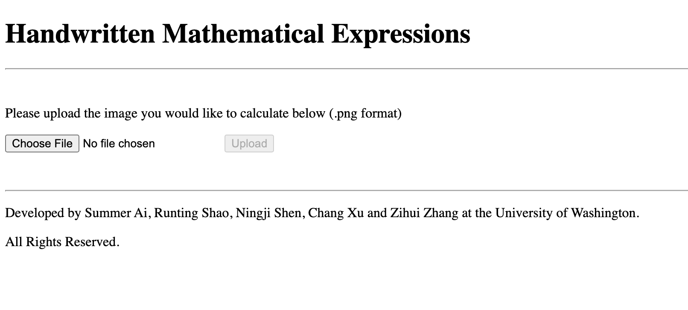

# Hand-written Mathematical Expression Recognization System
[](https://staging.travis-ci.com/515handwritten-expression/515-handwritten-mathematical-expression)

Our Handwritten Mathmatical Expression Recognization System aims to take handwritten mathematical expressions as inputs, recognize the expressions, perform the calculation, and generate a printed version of the results. We build and train a deep learning model to recognize handwritten expressions and implement a function to perform the calculation. We deliver the user-provided expressions in a readable and print-friendly format using LaTeX, along with the results of the expressions. 

With our system, the pain of computing complex mathematical expressions by hand can be relifed. Our system is going to quickly convert the handwritten expressions to a machine-readable version and generate the calculation result.

### Directory Structure
```
.
├── LICENSE
├── README.md
├── data
│   ├── TestData
│   │   ├── predPNG
│   │   │   └── ...
│   │   ├── testPNG
│   │       └── ...
│   ├── TrainData
│   │   └── ...
│   │       └── ...
│   └── testimg
│       ├── ...
│       │   └── ...
│       └── ...
├── examples
|   ├── example_1.png
|   └── ...
├── docs
│   ├── Design Specification.pdf
│   ├── FunctionalSpec.docx
│   └── webpage.png
├── handwritten_math_expression
│   ├── ImagePreprocessing.py
│   ├── LeNetModel_v3.h5
│   ├── generateStrForLatexAndTree.py
│   ├── index
│   │   ├── index.py
│   │   ├── myscript.py
│   │   ├── results
│   │   │   ├── MathJaxResult.txt
│   │   │   └── calculationResult.txt
│   │   ├── templates
│   │   │   ├── index.html
│   │   │   ├── result.html
│   │   │   └── wait.html
│   │   └── uploads
│   │       ├── hard_8
│   │       │   ├── 01.png - 08.png
│   │       │   └── hard_8.pkl
│   │       └── hard_8.png
│   ├── label_map_v3.npy
│   ├── main.py
│   ├── stringCalculation.py
│   ├── stringMathJaxConverter.py
│   └── tools
│       ├── LoadData.py
│       └── train_model.py
├── requirements.txt
├── setup.py
├── testTravisci
└── tests
    ├── LeNetModel_v3.h5
    ├── __init__.py
    ├── label_map_v3.npy
    ├── test_1
    │   └── imgseg
    │       ├── 01.png - 05.png
    │       └── test_1.pkl
    ├── test_GenerateStrForLatexAndTree.py
    ├── test_ImagePreprocessing.py
    ├── test_stringCalculation.py
    ├── test_stringMathJaxConverter.py
    └── train_model.ipynb
```


### Tutorial for how to use the hand-written mathematical expression recognization system
#### Preperation and Installation
Our system requires python3.5-python3.7 pre-installed.

To run the system, you will need to begin by cloning the system on your own computer by using the following command:
```
git clone https://github.com/515handwritten-expression/515-handwritten-mathematical-expression.git
```
Next, to install the package you will need to go into the directory and run the setup.py file:
```
cd 515-handwritten-mathematical-expression/
python setup.py install
```
Now you should be able to run the server in the index folder
```
cd handwritten_math_expression/index/
python3 index.py
```
Then, open the browser and go to the local host http://127.0.0.1:5000/, and you should see the webpage as the following




#### How to use the systme
To understand how to use the Hand-written Mathematical Expression Recognization System, please refer to the example video demo.mov in the <b>docs</b> folder.
<ol>
<li>The users first hit the <b>Choose file</b> buttom, and upload a <b>.png</b> file for the mathematical expression they want to use the system on. Then hit the <b>upload</b> buttom to upload the image.</li>
<li>Once the image is uploaded, the website will show <b>calculating</b>, indicating that the website is calculating.</li>
<li>Once the calculation is finished, a printed version of the expression will be shown on the webpage. If the expression is calculable (containing only numbers and calculable operations), a calculation result will appear on the website.</li>
<li>If the calculation takes more than 30 seconds. It is possible that the backend runs into a error. We recommand going back to the starting site and try with another image.</li>
</ol>


### Limitations
The accuracy of our model is around 86%.

Currently, our system can only recognize the following symbols:

-, (, ), +, =,
,
e
,
,
,
,
,
,
,
,
,
fractions,
and integers (0-9)

Our system can only perform calculation only on integers and special constants  and e. Our system cannot solve functions that contain variables like  and numbers with floating-point.

For power, our system can only identify power expression with base being a single integer. We cannot recognize power with a complex expression as its base. Besides, our system only recognize the first digit after the power sign. For example, if the target image is , our system can only identify 

Due to the limitation of the system, uploaded image should be a png file and the size should be smaller than 50kb, black expressions on white background. Symbols in the expression should not connect to each other. There should be white space between symbols. There should not be other thing on the image except the math expression.
